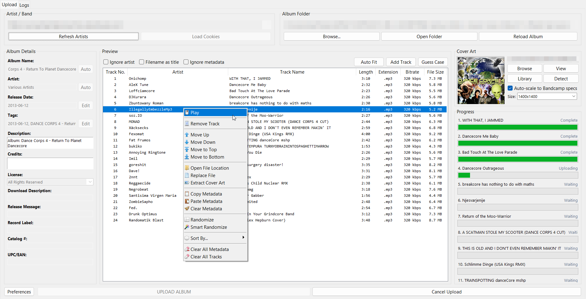

  
  
  
  

# Bandcamp Auto Uploader

> **Upload your music to Bandcamp in bulk — no Pro account needed.**
> Drag in a folder of audio files, review the tracks, and upload. That's it.

Forked from [7x11x13](https://github.com/7x11x13)'s original work.

---

## Table of Contents

- [Quick Start](#-quick-start)
- [What You Can Do](#-what-you-can-do)
- [How It Works](#-how-it-works)
- [Hotkeys](#-hotkeys)
- [Track Table Tips](#-track-table-tips)
- [The Right-Click Context Menu](#-the-right-click-context-menu)
- [Settings at a Glance](#-settings-at-a-glance)
- [Supported Audio Formats](#-supported-audio-formats)
- [FAQ](#-faq)
- [Third-party licenses](#-third-party-licenses)
- [Need Help?](#-need-help)

---

## Quick Start

1. **Download the app** — grab the latest `BandcampAutoUploaderGUI.exe` from the [Releases page](https://github.com/Nai64/BandcampAutoUploader/releases). No Python installation needed.
2. **Launch it** — the upload window opens immediately.
3. **Log in** — click the **Artists** button. The app finds your Bandcamp login from Chrome, Firefox, Edge, or other browsers and shows your artist pages.
4. **Pick an artist** — select which Bandcamp page to upload to.
5. **Drag in an album folder** — drop a folder with your audio files onto the window. The app reads track titles, artist names, cover art, and more from your files' metadata.
6. **Upload** — click the **Upload** button and the app does the rest (cover art, tracks, album info).

> [!TIP]
> Your settings, prices, and preferences are saved automatically to `Documents\Bandcamp Auto Uploader\config.json`.

---

## What You Can Do

| Feature | What it means for you |
| :--- | :--- |
| **Bulk upload** | Upload whole albums at once instead of one track at a time in a browser |
| **Any audio format** | FLAC, WAV, AIFF, MP3, OGG, Opus, M4A/AAC, MOD, XM — lossy formats are converted to FLAC; lossless files and tracker modules go through as-is |
| **Cover art auto-detect** | Finds cover images in your album folder, or extracts them from audio tags |
| **Browser login** | Reads your Bandcamp session from Chrome, Firefox, Edge, Brave, Opera, Vivaldi, and more |
| **Track table search** | Quick-find tracks with a real-time search bar (highlight or hide non-matches) |
| **Customizable hotkeys** | Rebind Undo, Redo, Upload, and Cancel to whatever you like |
| **Per-track metadata** | Edit artist, title, comment, price, NYP, tags, ISRC, cover, and more per track |
| **Album templates** | Save your common album settings (prices, tags, descriptions) as presets |
| **Undo / Redo** | Step back through your track-table edits with <kbd>Ctrl</kbd>+<kbd>Z</kbd> / <kbd>Ctrl</kbd>+<kbd>Y</kbd> |
| **Description auto-fill** | Reusable templates for album descriptions and credits |
| **CSRF auto-refresh** | If your session expires mid-upload, the app refreshes it and retries automatically |
| **Toast notifications** | Get a toast when uploads complete (or for errors) |
| **Track locking** | Lock individual tracks to protect their metadata from being overwritten by bulk actions |
| **Randomize / Smart Randomize** | Shuffle track order, or shuffle with smart grouping to keep multi-part tracks together |
| **Extract from filename** | Parse track number and title from filenames like `01 - Song Name.flac` |
| **Drag-and-drop** | Drop audio files or whole album folders onto the track table |

---

## How It Works (the short version)

1. The app grabs your Bandcamp login from your browser's cookies — **your credentials never leave your computer**.
2. It authenticates with Bandcamp's standard artist edit interface (the same one you use in a browser).
3. Lossy formats (MP3) are converted to FLAC 16-bit 44.1 kHz (Bandcamp's preferred format) via FFmpeg. Lossless files (FLAC, WAV, AIFF) and tracker modules (MOD, XM) are uploaded as-is.
4. Cover art is uploaded, then tracks are uploaded with their metadata.
5. Everything lands on your Bandcamp artist page — done.

$$ \text{Upload} = f(\text{audio}, \text{cookies}, \text{FFmpeg}) \rightarrow \text{Bandcamp} $$

---

## Hotkeys

All four are user-customizable from **Preferences → Hotkeys**. Multi-key sequences (like `Ctrl+Space` then `Enter`) are supported.

| Action | Default |
| :--- | :--- |
| Undo | <kbd>Ctrl</kbd>+<kbd>Z</kbd> |
| Redo | <kbd>Ctrl</kbd>+<kbd>Y</kbd> |
| Upload album | <kbd>Ctrl</kbd>+<kbd>Enter</kbd> |
| Cancel album | <kbd>Ctrl</kbd>+<kbd>Space</kbd>, <kbd>Enter</kbd> |

> [!TIP]
> To rebind, double-click a row in Preferences → Hotkeys, then press the keys you want.

---

## Track Table Tips

The track table supports real-time filtering. Type in the **search bar** above the table to narrow the visible rows.

> [!NOTE]
> There are two search modes, switchable in **Preferences → Interface → Track Table Columns**:
> - **Highlight mode (v1)** — non-matching rows are greyed out but stay visible
> - **Hide mode (v2, default)** — non-matching rows are detached so only matches remain

> [!IMPORTANT]
> Pressing the **Artist** column header toggles the artist name on/off across all tracks and the uploaded metadata. The data is still in the file; this only affects what's shown in the table and what's sent to Bandcamp.

---

## The Right-Click Context Menu

Right-click any track row to access:

- **Play** — open the file in your default player
- **Lock / Unlock** — protect a track from bulk edits
- **Remove Track** — drop the track from the album
- **Move Up / Down / Top / Bottom** — reorder
- **Open File Location** — open the containing folder
- **Replace File** — swap the audio file (keeps the metadata)
- **Extract Cover Art** — save embedded art to a file
- **Set Track Cover as Album Cover** — promote per-track cover to the album
- **Copy / Paste Metadata** — copy from one track, paste to many
- **Revert to Original** — restore the file's original metadata
- **Clear Metadata** — blank the editable fields
- **Randomize / Smart Randomize** — shuffle, intelligently
- **Sort By** — submenu of sort criteria (file size, length, title, artist, track #, price, year, genre, bitrate, sample rate, channels, bit depth, album, album artist, composer, ISRC)
- **Clear All Metadata** / **Clear All Tracks** — bulk reset
- **Upload as Single** — upload just this track as a standalone release

> [!TIP]
> Most of these are toggleable in **Preferences → Context Menu**. Disable the ones you don't use to keep the menu lean.

---

## Settings at a Glance

| Section | What you'll find |
| :--- | :--- |
| **General** | Apply-immediately, maximize-on-open, tooltips, metadata auto-load, session.txt, smart-randomize, cover scaling, description auto-fill, search highlight mode, locked-track color, log file limit, file size unit |
| **Notifications** | Toasts on/off, duration, position |
| **Upload** | Default prices (album/track), NYP, streaming/download toggles, per-track and per-album metadata (require email, pro, composer, publisher, public/private) |
| **Interface** | Track table column sizes (lockable), track search behavior, locked-track highlight color, log filtering |
| **Hotkeys** | Undo / Redo / Upload / Cancel — all rebindable |
| **Context Menu** | Show icons, remove dividers, per-item on/off (Play, Remove, Move, File ops, Metadata ops, Randomize, Sort, Clear) |
| **Advanced** | Power-user knobs |
| **About** | Version info, third-party licenses, update check |

> [!NOTE]
> All settings live in `Documents\Bandcamp Auto Uploader\config.json` — feel free to hand-edit, but the GUI is the safe path.

---

## Supported Audio Formats

| Format | Extension | Uploaded as | Notes |
| :--- | :--- | :--- | :--- |
| FLAC | `.flac` | FLAC (as-is) | Bandcamp's preferred lossless format |
| WAV | `.wav` | WAV (as-is) | Lossless, no re-encoding |
| AIFF | `.aiff`, `.aif` | AIFF (as-is) | Lossless, no re-encoding |
| MP3 | `.mp3` | Converted to FLAC | Requires FFmpeg |
| OGG Vorbis | `.ogg` | Converted to FLAC | Requires FFmpeg |
| Opus | `.opus` | Converted to FLAC | Requires FFmpeg |
| M4A / AAC | `.m4a`, `.aac` | Converted to FLAC | Requires FFmpeg |
| Tracker modules | `.mod`, `.xm` | FLAC | Converted to FLAC |

> [!WARNING]
> FFmpeg is **required** for converting MP3, OGG, Opus, and M4A/AAC files. If conversion fails, make sure FFmpeg is on your `PATH` or in the app folder.

---

## FAQ

### Do I need a Pro account?
**No.** This works with any free Bandcamp artist account.

### Will I get banned?
The tool uses your own browser session and respects rate limits — it looks just like normal browser usage. Use it responsibly.

### Why does it need my browser cookies?
It reads your Bandcamp login session from your browser to authenticate. Cookies are never sent anywhere except to bandcamp.com.

### Upload got a 403 error?
Click the **Artists** button to re-authenticate. The app will re-scan your browsers for a fresh session.

### What audio formats are supported and which get converted?
FLAC, WAV, AIFF, MP3, OGG, Opus, M4A/AAC, MOD, XM. Only lossy formats (MP3, OGG, Opus, M4A/AAC) are converted to FLAC 16-bit 44.1 kHz before upload. Lossless files (FLAC, WAV, AIFF) and tracker modules (MOD, XM) are uploaded without re-encoding. FFmpeg is required for lossy conversion.

### What if I don't use a supported browser?
You can upload a `cookies.txt` file instead. The CLI (`bc-upload`) guides you through this.

### How do I lock a track to protect its metadata?
Right-click the track → **Lock Track**. A locked track is highlighted and bulk actions skip it. Right-click again to unlock.

### How do I customize the hotkeys?
Open Preferences → **Hotkeys**. Double-click any action and press the key combo you want. Multi-key sequences (e.g. <kbd>Ctrl</kbd>+<kbd>Space</kbd> then <kbd>Enter</kbd>) are supported.

More tips

You can also set up an <em>album template</em> with your common prices, tags, and description so every new album starts pre-filled. Templates live in the same config folder.

---

## Third-party licenses

- [Azure ttk theme](https://github.com/rdbende/Azure-ttk-theme) by rdbende is bundled under the MIT License.
- [TKinterModernThemes](https://github.com/RobertJN64/TKinterModernThemes) by Robert Nies is used for Sun-Valley theme support under the MIT License. TKinterModernThemes credits the included Sun-Valley theme work to [rdbende](https://github.com/rdbende).
- [Fugue Icons](https://p.yusukekamiyamane.com/) by Yusuke Kamiyamane is used for context menu icons (CC-BY 3.0).

---

## Need Help?

- [Browse open issues](https://github.com/Nai64/BandcampAutoUploader/issues)
- [Open a new issue](https://github.com/Nai64/BandcampAutoUploader/issues/new)
- [Releases page](https://github.com/Nai64/BandcampAutoUploader/releases)
